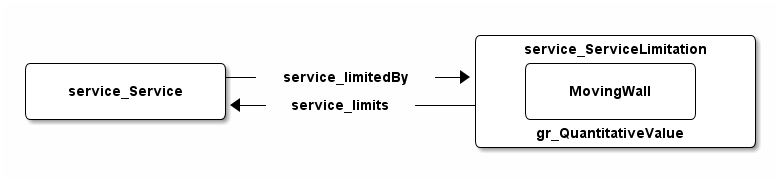

# Introduction

The **Moving Wall Ontology (MWO)** is a vocabulary to express a quantitative limitation to a service event.

In the real world limitations of document services are often called 'retention period', 'access restriction' or 'moving wall'. This Vocabulary aims to be used in conjunction with document services, but it might be used with other services too.

## Status of this document

This document is an early draft. [Feedback](https://github.com/dini-ag-kim/movingwall/issues) is welcome!

## Namespaces and Ontology

The URI namespace of this ontology is ... The namespace prefix `mwo` is recommeded.
The URI of this ontology as a whole is ...

    @prefix mwo: <https://w3id.org/mwo#> .
    @base        <https://w3id.org/mwo> .

The following namspace prefixes are used to refer to related ontologies:

	@prefix dso:  <http://purl.org/ontology/dso#> .
	@prefix service: <http://purl.org/ontology/service#> .
	@prefix gr:   <http://purl.org/goodrelations/v1#> .
	@prefix owl:  <http://www.w3.org/2002/07/owl#> .
	@prefix rdfs: <http://www.w3.org/2000/01/rdf-schema#> .
	@prefix vann: <http://purl.org/vocab/vann/> .
	@prefix xs:   <http://www.w3.org/2001/XMLSchema#> .
	@prefix dc:   <http://purl.org/dc/elements/1.1/> .
	@prefix skos: <http://www.w3.org/2004/02/skos/core#> .

The Moving Wall Ontology is defined in RDF/Turtle as following:

    <> a owl:Ontology ;
        rdfs:label "Moving Wall Ontology (MWO)" ;
        vann:preferredNamespacePrefix "mwo" ;
        dc:title "Moving Wall Ontology (MWO)" ;
        dc:description "A vocabulary to express a limitation to a document service"@en .

# Overview

A [service:Service] might be limited by a [MovingWall], which is a intersection of [service:ServiceLimitation] and [gr:QuantitativeValue].

To state that a [service:Service] is limited by a [MovingWall] use [service:limits].

# Classes

## MovingWall

[MovingWall]: #movingwall

A **moving wall** is some obstacle that may limit the use of a [service:Service]. 

    mwo:MovingWall a owl:Class ;
        rdfs:label "moving wall" ;
        rdfs:comment "A moving wall is some obstacle that may limit the use of a service:Service"@en ;
        rdfs:subClassOf [
            a owl:Class ;
            owl:intersectionOf (service:ServiceLimitation gr:QuantitativeValue)
        ] .

# Properties

## limitedBy

[limitedBy]: #limitedBy

Used to relate a [service:Service] instance that is **limited by** a [MovingWall] instance to this service limitation.

To relate a [MovingWall] to a [dso:DocumentService] use [service:limits]. [service:limits] is defined by the [Service Ontology].

    service:limitedBy a owl:AnnotationProperty , owl:ObjectProperty ;
        rdfs:label "limited by" ;
        skos:scopeNote "Used to relate a service:Service instance that is limited by a moving wall instance to this service limitation."@en ;
        rdfs:isDefinedBy <http://purl.org/ontology/service> .

## hasValue

[hasValue]: #hasvalue

Used to relate a [MovingWall] to its quantitative value. [gr:hasValue] is defined by [GoodRelations].

    gr:hasValue a owl:AnnotationProperty , owl:DatatypeProperty ;
        skos:scopeNote "Used to relate a moving wall to its quantitative value."@en ;
        rdfs:isDefinedBy <http://purl.org/goodrelations/v1> .

## hasUnitOfMeasurement

[hasUnitOfMeasurement]: #hasunitofmeasurement

Used to relates a [MovingWall] to its unit of measurement. [gr:hasUnitOfMeasurement] is defined by [GoodRelations].

    gr:hasUnitOfMeasurement a owl:AnnotationProperty , owl:DatatypeProperty ;
        skos:scopeNote "Used to relate a moving wall to its quantitative value."@en ;
        rdfs:isDefinedBy <http://purl.org/goodrelations/v1> .

# References

## Informative References

* [Document Service Ontology]
* [Service Ontology]
* [GoodRelations]
* [DAIA Ontology]
* [Bibliographic Ontology]
* [Enumeration and Chronology of Periodicals Ontology (ECPO)]
* [Dublin Core Metadata Terms]
* [XML Schema]

[Document Service Ontology]: http://purl.org/ontology/dso
[dso:DocumentService]: http://purl.org/ontology/dso#DocumentService
[dso:Loan]: http://purl.org/ontology/dso#Loan
[dso:Presentation]: http://purl.org/ontology/dso#Presentation

[Service Ontology]: http://purl.org/ontology/service
[service:limits]: http://purl.org/ontology/service#limits 
[service:limitedBy]: http://purl.org/ontology/service#limitedBy
[service:Service]: http://purl.org/ontology/service#Service
[service:ServiceLimitation]: http://purl.org/ontology/service#ServiceLimitation

[GoodRelations]: http://purl.org/goodrelations/v1
[gr:hasValue]: http://purl.org/goodrelations/v1#hasValue
[gr:hasUnitOfMeasurement]: http://purl.org/goodrelations/v1#hasUnitOfMeasurement
[gr:QuantitativeValue]: http://purl.org/goodrelations/v1#QuantitativeValue

[DAIA Ontology]: http://purl.org/ontology/daia
[daia:availableFor]: http://purl.org/ontology/daia/availableFor 
[daia:availableOf]: http://purl.org/ontology/daia/availableOf 
[daia:unavailableFor]: http://purl.org/ontology/daia/unavailableFor 
[daia:unavailableOf]: http://purl.org/ontology/daia/unavailableOf

[Enumeration and Chronology of Periodicals Ontology (ECPO)]: http://purl.org/ontology/ecpo
[Bibliographic Ontology]: http://purl.org/ontology/bibo
[Dublin Core Metadata Terms]: http://dublincore.org/documents/dcmi-terms/
[XML Schema]: http://www.w3.org/TR/xmlschema-0/

# Examples

`examples.md`{.include}